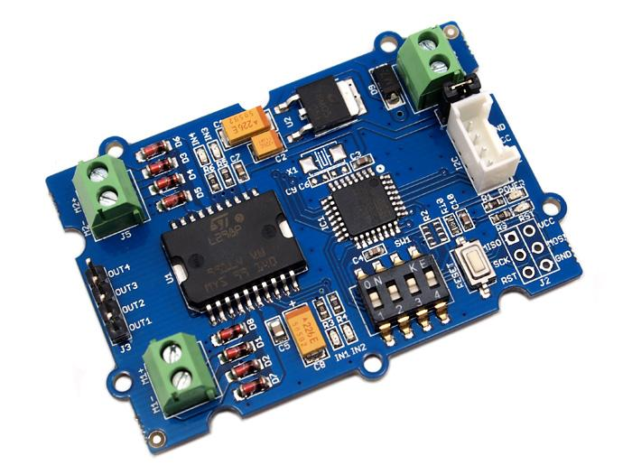
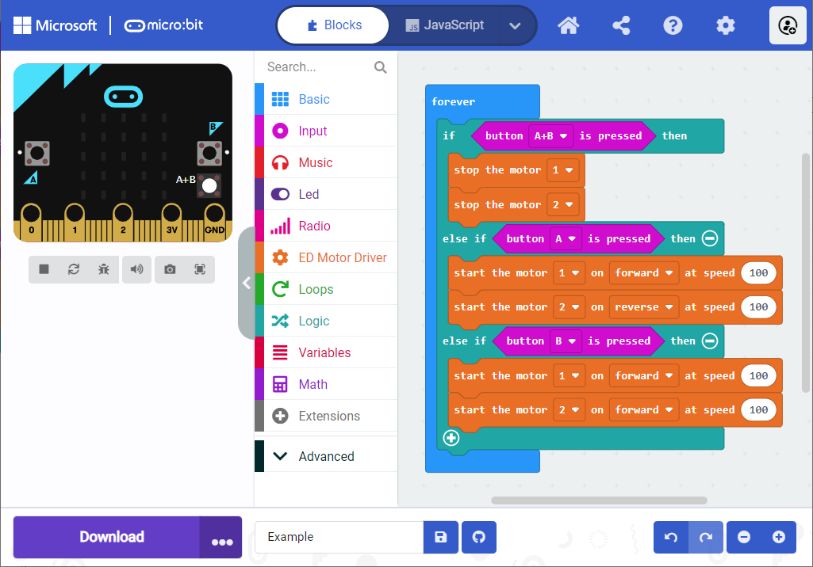

# ED Motor Driver for micro:bit

A Microsoft MakeCode package for driving the [Grove I2C Motor Driver Board](https://wiki.seeedstudio.com/Grove-I2C_Motor_Driver_V1.3).



## Build

- Clone GitHub repository
```
> git clone https://github.com/emmanue1/pxt-ed-motor-driver.git
> cd pxt-ed-motor-driver
```

- Install [Microsoft Programming Experience Toolkit (PXT)](https://github.com/microsoft/pxt)
```
> npm install -g pxt
```

- Install [pxt-microbit](https://github.com/microsoft/pxt-microbit) locally
```
> pxt target microbit
> pxt install
```

- Initialize environement and build project
```
> pxt build --clean
```

- Launch local Web server
```
> pxt serve
```

## Run

- Open local Microsoft MakeCode | micro:bit Web studio at [http://localhost:3232/index.html#](http://localhost:3232/index.html#)
- Create a new project
- Upload local driver :
  - Click on '+ Extension'
  - Click on 'Import File'
  - Select your .hex driver file in 'built' folder
- Add some blocks, for example :

- Enjoy !

## Usage ... behind the scenes

- Go round

```
input.onButtonPressed(Button.A, () => {
    ed_grove_i2c_motor_driver.motorOn(ed_grove_i2c_motor_driver.Motors.Motor1, ed_grove_i2c_motor_driver.MotorDirection.Forward, 100);
    ed_grove_i2c_motor_driver.motorOn(ed_grove_i2c_motor_driver.Motors.Motor2, ed_grove_i2c_motor_driver.MotorDirection.Reverse, 100);
})
```

- Go forward

```
input.onButtonPressed(Button.B, () => {
    ed_grove_i2c_motor_driver.motorOn(ed_grove_i2c_motor_driver.Motors.Motor1, ed_grove_i2c_motor_driver.MotorDirection.Forward, 100);
    ed_grove_i2c_motor_driver.motorOn(ed_grove_i2c_motor_driver.Motors.Motor2, ed_grove_i2c_motor_driver.MotorDirection.Forward, 100);
})
```

- Stop

```
input.onButtonPressed(Button.AB, () => {
    ed_grove_i2c_motor_driver.motorOff(ed_grove_i2c_motor_driver.Motors.Motor1);
    ed_grove_i2c_motor_driver.motorOff(ed_grove_i2c_motor_driver.Motors.Motor2);
})
```

## License

MIT

## Supported targets

* for PXT/microbit
